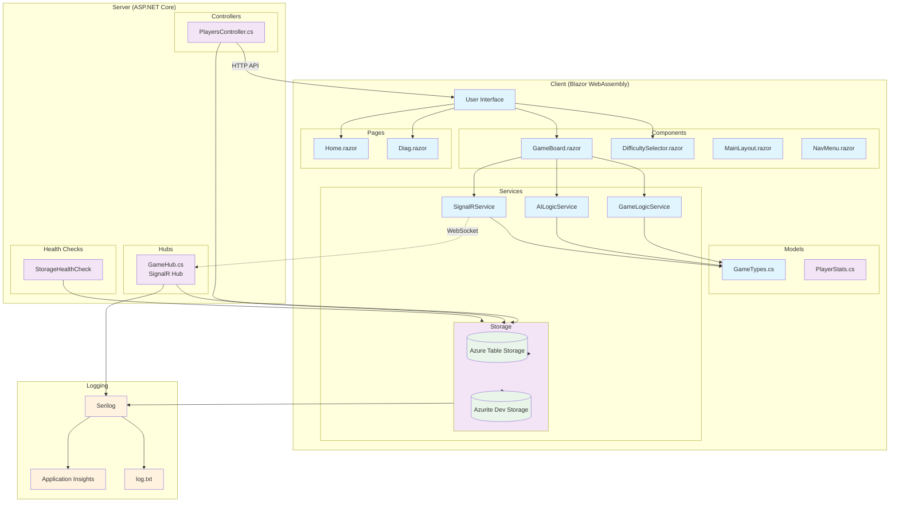
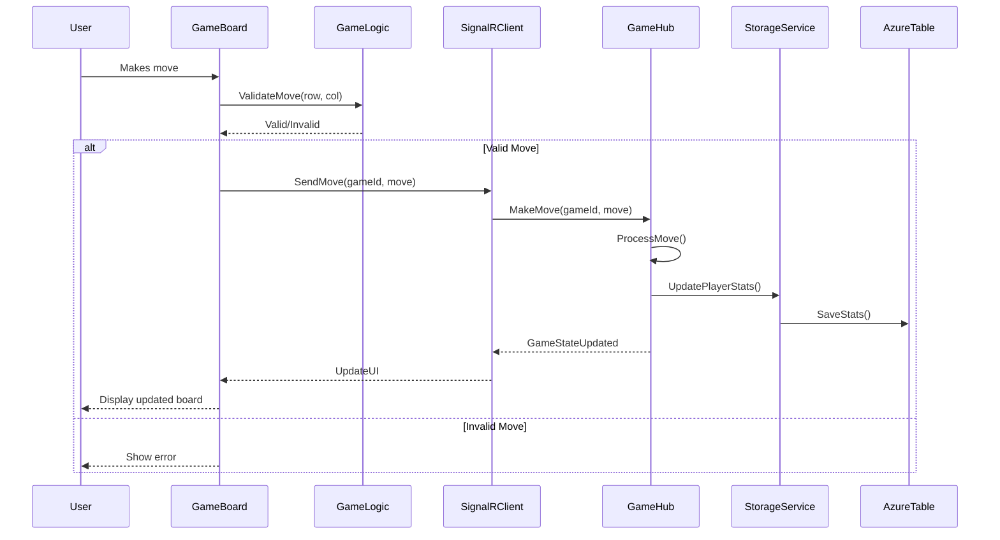
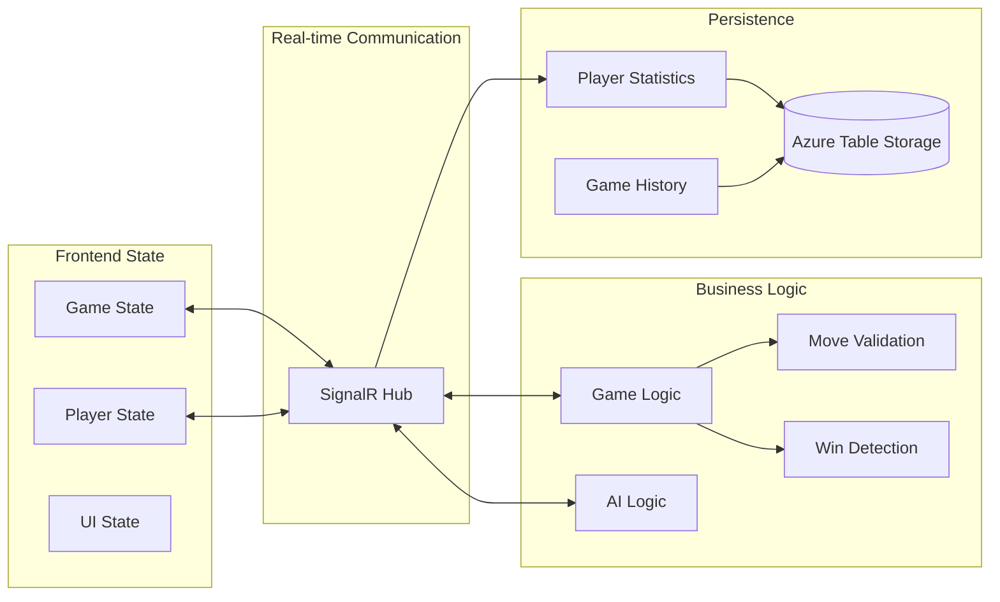
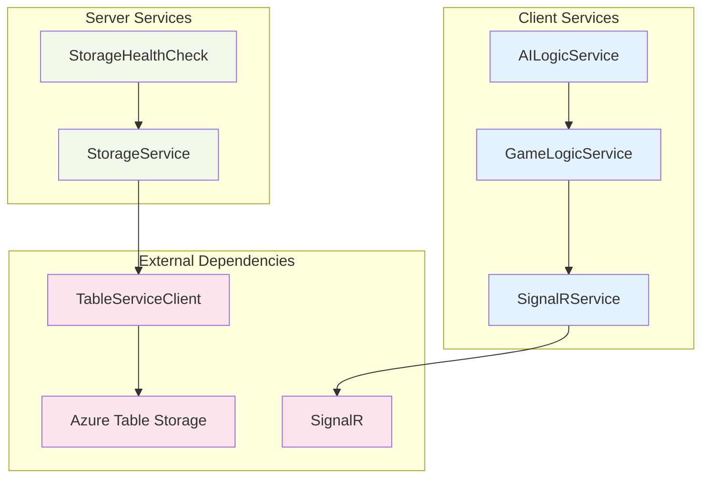
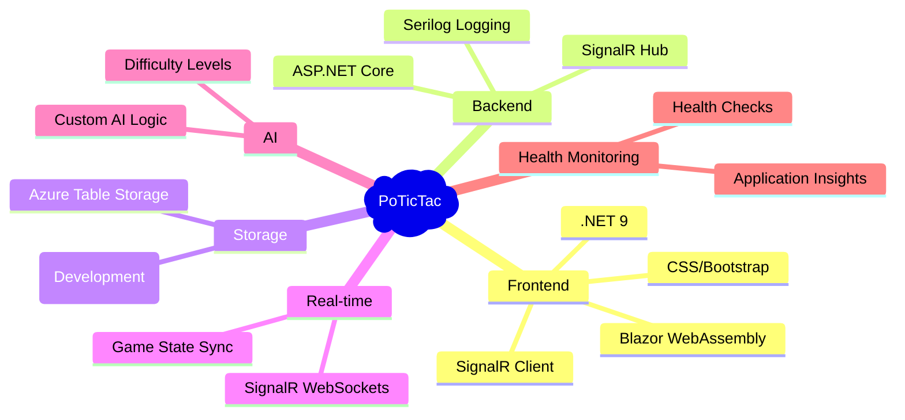
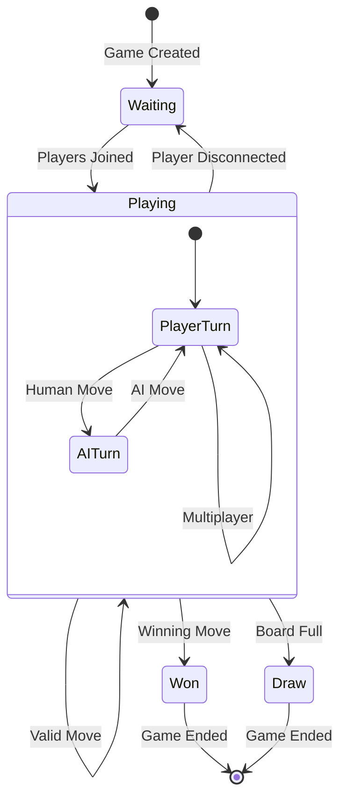

# PoTicTac Architecture Diagram

## System Overview

```mermaid
graph TB
    subgraph "Client (Blazor WebAssembly)"
        UI[User Interface]
        subgraph "Components"
            GameBoard[GameBoard.razor]
            DiffSelect[DifficultySelector.razor]
            MainLayout[MainLayout.razor]
            NavMenu[NavMenu.razor]
        end
        
        subgraph "Pages"
            Home[Home.razor]
            Diag[Diag.razor]
        end
        
        subgraph "Services"
            GameLogic[GameLogicService]
            AILogic[AILogicService]
            SignalRClient[SignalRService]
        end
        
        subgraph "Models"
            GameTypes[GameTypes.cs]
        end
    end
    
    subgraph "Server (ASP.NET Core)"
        subgraph "Hubs"
            GameHub[GameHub.cs<br/>SignalR Hub]
        end
        
        subgraph "Controllers"
            PlayersCtrl[PlayersController.cs]
        end
        
        subgraph "Services"
            Storage[StorageService]
        end
        
        subgraph "Health Checks"
            StorageHealth[StorageHealthCheck]
        end
        
        subgraph "Models"
            PlayerStats[PlayerStats.cs]
        end
    end
    
    subgraph "Storage"
        AzureTable[(Azure Table Storage)]
        Azurite[(Azurite Dev Storage)]
    end
    
    subgraph "Logging"
        Serilog[Serilog]
        AppInsights[Application Insights]
        LogFile[log.txt]
    end
    
    %% Client connections
    UI --> GameBoard
    UI --> DiffSelect
    UI --> Home
    UI --> Diag
    
    GameBoard --> GameLogic
    GameBoard --> AILogic
    GameBoard --> SignalRClient
    
    GameLogic --> GameTypes
    AILogic --> GameTypes
    SignalRClient --> GameTypes
    
    %% Client-Server communication
    SignalRClient -.->|WebSocket| GameHub
    PlayersCtrl -->|HTTP API| UI
    
    %% Server internal connections
    GameHub --> Storage
    PlayersCtrl --> Storage
    StorageHealth --> Storage
    
    %% Storage connections
    Storage --> AzureTable
    Storage --> Azurite
    
    %% Logging connections
    GameHub --> Serilog
    Storage --> Serilog
    Serilog --> LogFile
    Serilog --> AppInsights
    
    %% Styling
    %% Styling
    classDef client fill:#e1f5fe
    classDef server fill:#f3e5f5
    classDef storage fill:#e8f5e8
    classDef logging fill:#fff3e0
    
    class UI,GameBoard,DiffSelect,MainLayout,NavMenu,Home,Diag,GameLogic,AILogic,SignalRClient,GameTypes client
    class GameHub,PlayersCtrl,Storage,StorageHealth,PlayerStats server
    class AzureTable,Azurite storage
    class Serilog,AppInsights,LogFile logging
```

## Component Interaction Flow

```mermaid
sequenceDiagram
    participant User
    participant GameBoard
    participant GameLogic
    participant SignalRClient
    participant GameHub
    participant StorageService
    participant AzureTable
    
    User->>GameBoard: Makes move
    GameBoard->>GameLogic: ValidateMove(row, col)
    GameLogic-->>GameBoard: Valid/Invalid
    
    alt Valid Move
        GameBoard->>SignalRClient: SendMove(gameId, move)
        SignalRClient->>GameHub: MakeMove(gameId, move)
        GameHub->>GameHub: ProcessMove()
        GameHub->>StorageService: UpdatePlayerStats()
        StorageService->>AzureTable: SaveStats()
        GameHub-->>SignalRClient: GameStateUpdated
        SignalRClient-->>GameBoard: UpdateUI
        GameBoard-->>User: Display updated board
    else Invalid Move
        GameBoard-->>User: Show error
    end
```

## Data Flow Architecture

```mermaid
flowchart LR
    subgraph "Frontend State"
        GameState[Game State]
        PlayerState[Player State]
        UIState[UI State]
    end
    
    subgraph "Real-time Communication"
        SignalR[SignalR Hub]
    end
    
    subgraph "Business Logic"
        GameLogic[Game Logic]
        AILogic[AI Logic]
        MoveValidation[Move Validation]
        WinDetection[Win Detection]
    end
    
    subgraph "Persistence"
        PlayerStats[Player Statistics]
        GameHistory[Game History]
        TableStorage[(Azure Table Storage)]
    end
    
    GameState <--> SignalR
    PlayerState <--> SignalR
    SignalR <--> GameLogic
    SignalR <--> AILogic
    GameLogic --> MoveValidation
    GameLogic --> WinDetection
    SignalR --> PlayerStats
    PlayerStats --> TableStorage
    GameHistory --> TableStorage
```

## Service Dependencies

```mermaid
graph TD
    subgraph "Client Services"
        GLS[GameLogicService]
        ALS[AILogicService] 
        SRS[SignalRService]
    end
    
    subgraph "Server Services"
        SS[StorageService]
        SHC[StorageHealthCheck]
    end
    
    subgraph "External Dependencies"
        TSC[TableServiceClient]
        ATS[Azure Table Storage]
        SR[SignalR]
    end
    
    GLS --> SRS
    ALS --> GLS
    SRS --> SR
    SS --> TSC
    TSC --> ATS
    SHC --> SS
    
    classDef clientService fill:#e3f2fd
    classDef serverService fill:#f1f8e9
    classDef external fill:#fce4ec
    
    class GLS,ALS,SRS clientService
    class SS,SHC serverService
    class TSC,ATS,SR external
```

## Technology Stack

```mermaid
mindmap
  root)PoTicTac(
    Frontend
      Blazor WebAssembly
      .NET 9
      SignalR Client
      CSS/Bootstrap
    Backend
      ASP.NET Core
      SignalR Hub
      Serilog Logging
    Storage
      Azure Table Storage
      Azurite (Development)
    Real-time
      SignalR WebSockets
      Game State Sync
    AI
      Custom AI Logic
      Difficulty Levels
    Health Monitoring
      Health Checks
      Application Insights
```

## Game Flow State Machine

```mermaid
stateDiagram-v2
    [*] --> Waiting: Game Created
    Waiting --> Playing: Players Joined
    Playing --> Playing: Valid Move
    Playing --> Won: Winning Move
    Playing --> Draw: Board Full
    Won --> [*]: Game Ended
    Draw --> [*]: Game Ended
    Playing --> Waiting: Player Disconnected
    
    state Playing {
        [*] --> PlayerTurn
        PlayerTurn --> AITurn: Human Move
        AITurn --> PlayerTurn: AI Move
        PlayerTurn --> PlayerTurn: Multiplayer
    }
```
